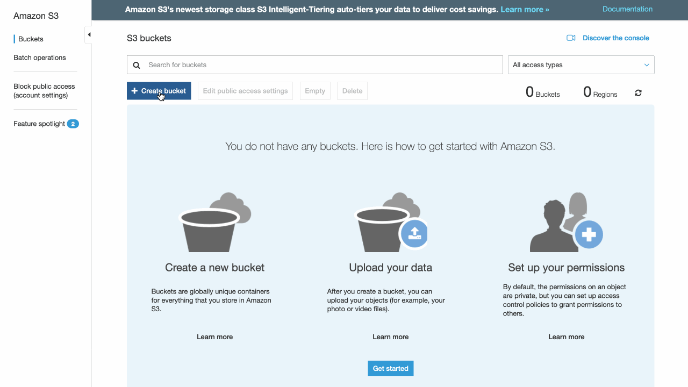

# Basic Serverless Data Pipeline
TODO: Document this...

## About the dataset
This is a completely fabricated Australian superannuation contributions FSI data set based on the [Patterns of voluntary worker retirement savings: a longitudinal analysis](https://www.google.com/url?sa=t&rct=j&q=&esrc=s&source=web&cd=4&ved=2ahUKEwiF0uPk6vzlAhVBfisKHWnnAeMQFjADegQIBBAC&url=https%3A%2F%2Fwww.aph.gov.au%2FDocumentStore.ashx%3Fid%3D563af7ab-5166-4894-aea8-385922d591dc%26subId%3D405213&usg=AOvVaw1h4zxR2g6tcAhOWaKi7a30) research paper. It is in [Apache Parquet](http://parquet.apache.org/) format, partitioned by year and month, and compressed with the Snappy codec.

## Clicker vs Coder
### Via the AWS Console (OK)

### Via the AWS CDK (Awesome)
```typescript
new Bucket(this, 'data-demo-123456789012-us-east-1');
```

## References
1. Clicker GIFs were created using [LICEcap](https://www.cockos.com/licecap/), which is awesome.